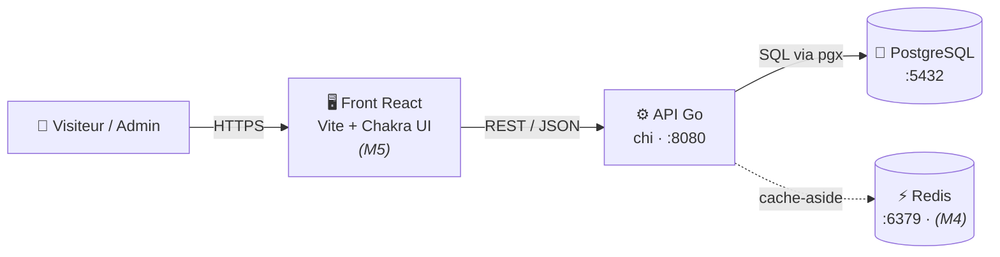
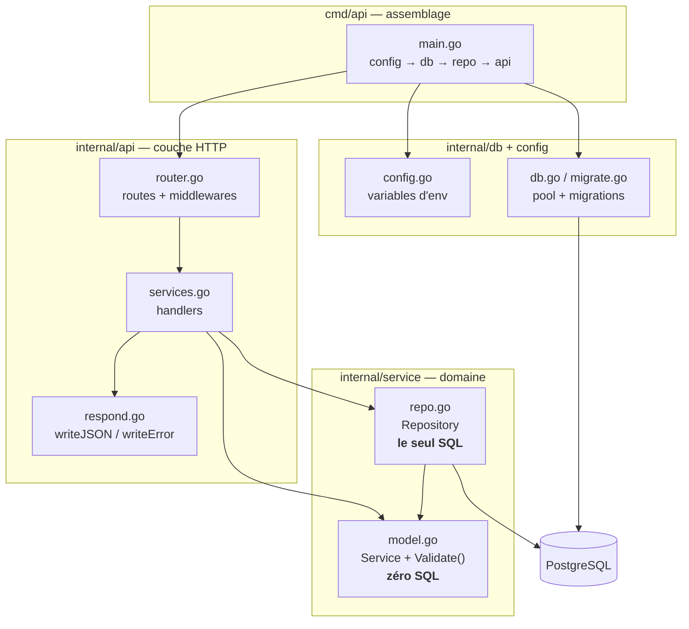
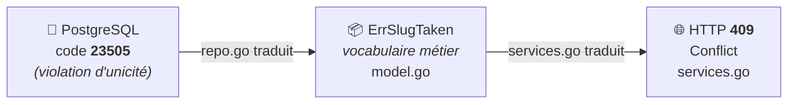
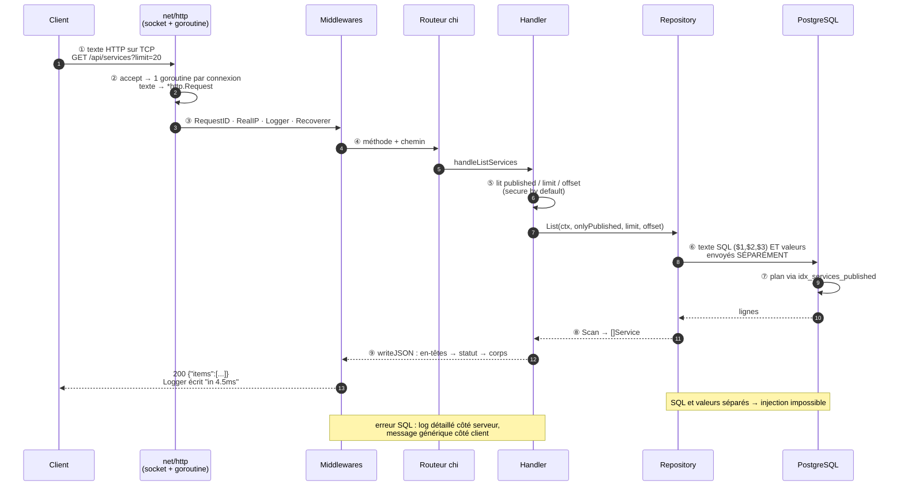

# Corporate Service Portal — site full-stack (Go + React)

> **Contexte.** Reprise et modernisation d'une maquette réalisée lors de mon stage de
> développeur web full-stack chez CICAPE. Ce dépôt ne reprend que **certaines briques du
> site**, réécrites au propre : back-end **API REST en Go** (PostgreSQL, cache Redis,
> authentification, tests) et front **React / Vite / Chakra UI**.
> Le projet a été repris et poussé récemment, d'où les dates de commit.
>
> Le site lui-même : **vitrine publique + catalogue d'offres + espace membre**.
>
> Ce README documente le fonctionnement, les décisions et le *pourquoi*, au fil de l'avancement.

---

## 🗺️ Parallèles Go ↔ ce que je connais (Django / Express)

| Concept | Go (ici) | Django | Express |
|---|---|---|---|
| Point d'entrée | `cmd/api/main.go` | `manage.py` + `wsgi.py` | `app.js` / `server.js` |
| Déclaration des routes | `internal/api/router.go` (chi) | `urls.py` | `app.get(...)`, `router` |
| Handler / vue | `func(w http.ResponseWriter, r *http.Request)` | une *view* | `(req, res) => {}` |
| Réponse | on **écrit** dans `w` | on **retourne** un `HttpResponse` | `res.json(...)` |
| Middlewares | `r.Use(...)` | `MIDDLEWARE = [...]` | `app.use(...)` |
| Config | variables d'env (`internal/config`) | `settings.py` | `process.env` / dotenv |
| Dépendances | `go.mod` / `go.sum` | `requirements.txt` | `package.json` |
| Lancer le serveur | `go run ./cmd/api` | `manage.py runserver` | `node app.js` |

**Différence de mentalité à retenir** : en Django/Express la *vue* **retourne** une réponse.
En Go, le handler **écrit** dans un objet réponse (`w`) qu'on lui passe — il ne retourne rien.
C'est plus proche de `res.write()` en Express que de `return HttpResponse(...)`.

---

## 🏛️ Architecture (modèle C4)

> Convention suivie : le **modèle C4** — 4 niveaux de zoom (Context → Container → Component → Code),
> devenu le standard à la place d'UML. Schémas écrits en **Mermaid**, donc versionnés
> avec le code et rendus directement par GitHub.

### Niveau 2 — Containers (les grands blocs)



### Niveau 3 — Composants internes de l'API



**À lire dans ce schéma** : les flèches vont **toujours** de l'extérieur vers le domaine.
`repo.go` connaît `model.go`, mais **jamais l'inverse** — et `model.go` ne connaît ni HTTP ni SQL.
C'est ce qui permet de tester les règles métier sans base de données.

### 🔍 Zoom : `model.go` vs `repo.go` (la question centrale)

**Django fusionne les deux, ici on les sépare.** En Django, `Service(models.Model)` contient à la fois
les champs (*ce qu'est* un service) et `Service.objects.filter(...)` (*comment* on le lit en base) :
c'est le pattern **Active Record**. Ici on utilise le pattern **Repository**, qui coupe en deux.

| | `model.go` | `repo.go` |
|---|---|---|
| Répond à | *Qu'EST-CE qu'un service ?* | *Comment on la lit/écrit en base ?* |
| Contient | `Service`, `CreateInput`, `Validate()`, erreurs métier | `Repository`, les requêtes SQL |
| Importe | **stdlib uniquement** (`errors`, `fmt`, `time`) | **pgx** (PostgreSQL) |
| Sait que PostgreSQL existe | ❌ non | ✅ oui — **seul fichier** du domaine |

**Les imports SONT l'architecture** : sur le schéma niveau 3, `model.go` est le seul nœud d'où aucune
flèche ne sort — et effectivement, il n'importe rien d'autre que la bibliothèque standard.

#### La chaîne de traduction (une notion, trois couches)



Chaque couche **parle sa langue et traduit vers la suivante**. Même chaîne pour le 404 :
`pgx.ErrNoRows` → `ErrNotFound` → `404`. Résultat : le handler choisit un code HTTP
**sans jamais connaître PostgreSQL**.

#### Le test le prouve
`model_test.go` importe **uniquement `testing`** : il valide les règles métier en **4 ms, sans base**.
Si la validation vivait dans le repository (façon Django), il faudrait une base qui tourne pour tester
« le niveau doit valoir debutant, intermediaire ou avance ».

#### Test de résistance : « on passe à SQLite demain »
Changent : `repo.go`, `db.go`. **Ne changent pas** : `model.go`, `services.go`, `model_test.go`.
En Active Record, la réponse serait « tout ».

### Le trajet d'une requête (GET /api/services)



---

## 🔢 Codes de statut HTTP (mémo)

**Modèle mental : le premier chiffre dit QUI est responsable.**

| Famille | Sens | Codes utiles ici |
|---|---|---|
| **2xx** | ✅ succès | **200** OK · **201** Created (POST qui crée une ressource) · **204** No Content (DELETE réussi, pas de corps) |
| **3xx** | ↪️ redirection | 301/302 redirection · 304 Not Modified (cache) |
| **4xx** | ❌ **faute du CLIENT** | **400** requête malformée · **401** non authentifié · **403** authentifié mais pas autorisé · **404** introuvable · **409** conflit (email déjà pris) · **422** validation échouée · **429** trop de requêtes |
| **5xx** | 💥 **faute du SERVEUR** | **500** erreur interne · **502** mauvaise réponse d'un service amont · **503** indisponible |

**Deux pièges classiques (questions d'entretien) :**
- **401 vs 403** — `401` = « je ne sais pas qui tu es » (token absent/invalide → connecte-toi).
  `403` = « je sais qui tu es, mais tu n'as pas le droit » (user normal sur une route admin).
- **4xx vs 5xx** — si le client envoie une donnée invalide et qu'on répond `500`, **c'est un bug de notre côté** :
  la bonne réponse est `400`/`422`. Le `5xx` est réservé à **nos** pannes (base tombée, panic).

Conventions qu'on appliquera dans ce projet :
`GET` liste/détail → `200` · `POST` création → `201` · `PUT/PATCH` → `200` · `DELETE` → `204` ·
ressource absente → `404` · corps JSON invalide → `400` · règle métier violée → `409`/`422`.

---

## 📁 Structure

```
corporate-service-portal/
├── cmd/api/main.go          # point d'entrée : assemble config + routeur, gère démarrage/arrêt
├── internal/
│   ├── config/config.go     # lecture des réglages depuis l'environnement
│   └── api/
│       ├── router.go        # déclaration des routes + middlewares  (≈ urls.py)
│       └── health.go        # handler /health + utilitaire writeJSON
├── go.mod / go.sum          # dépendances (≈ requirements.txt / package.json)
└── README.md
```

**Pourquoi `internal/`** : c'est un nom réservé par Go — un paquet dans `internal/` **ne peut pas être importé
depuis un autre projet**. L'encapsulation est garantie par le compilateur, pas par une convention.

**Pourquoi `cmd/`** : convention Go pour « les exécutables ». S'il faut un jour un second binaire
(ex. un worker de scan), il ira dans `cmd/worker/` et réutilisera le même `internal/`.

---

## ⚙️ Décisions techniques (et pourquoi)

| Décision | Raison | Alternative écartée |
|---|---|---|
| **chi** comme routeur | léger, 100 % compatible `net/http`, rien de caché ; ajoute middlewares + params d'URL | **Gin** : plus « magique », on voit moins ce qui se passe |
| **pgx + SQL écrit à la main** (M2) | je vois le SQL, et c'est ce que le CV annonce | un ORM (GORM) : masque les requêtes |
| **Config par variables d'env** | même binaire en local et en prod, aucun secret dans le code | valeurs en dur / fichier de settings versionné |
| **Arrêt propre (graceful shutdown)** | un déploiement ne coupe pas les requêtes en cours | `os.Exit()` brutal |
| **`ReadHeaderTimeout`** | empêche une connexion ouverte sans headers d'immobiliser une ressource (Slowloris) | pas de timeout = fuite de ressources |

---

## ▶️ Lancer

```bash
docker compose up -d         # démarre PostgreSQL (:5432) et Redis (:6379)
go run ./cmd/api             # démarre l'API sur :8080
curl localhost:8080/health   # -> {"status":"ok"}
```

Gestion des dépendances :

```bash
docker compose ps       # état des services
docker compose logs -f  # suivre les logs
docker compose down     # arrêter (les données de la base sont conservées)
docker compose down -v  # arrêter ET SUPPRIMER les données
```

**Pourquoi Docker ici** : l'environnement (versions de Postgres/Redis, identifiants, ports) est
**décrit dans un fichier versionné** → reproductible à l'identique partout, et supprimable
proprement. Un volume `pgdata` fait survivre les données de la base ; Redis n'en a pas,
car un cache est **jetable** par nature (s'il est vidé, on relit la base et on le re-remplit).

Variables d'environnement (toutes optionnelles pour l'instant) :

| Variable | Défaut | Rôle |
|---|---|---|
| `PORT` | `8080` | port d'écoute |
| `DATABASE_URL` | *(vide)* | connexion PostgreSQL — utilisée au M2 |
| `REDIS_URL` | *(vide)* | connexion Redis — utilisée au M4 |

---

## 📓 Journal d'avancement

### ✅ M1 — Squelette qui tourne (2026-07-19)
- Module Go initialisé, structure `cmd/` + `internal/`.
- Routeur **chi** avec 4 middlewares : `RequestID` (id unique par requête), `RealIP`,
  `Logger` (trace méthode/chemin/statut/durée), `Recoverer` (un panic → 500 au lieu de tuer le serveur).
- Endpoint **`GET /health`** → `200 {"status":"ok"}`. Sert aux health checks (Docker/K8s/load balancer).
- **Arrêt propre** sur Ctrl+C / SIGTERM, avec 10 s de grâce pour les requêtes en cours.
- Vérifié : `go build` ✅ · `go vet` ✅ · `/health` → 200 ✅ · route inconnue → 404 ✅

### ✅ M2 — Base de données + première ressource (2026-07-20)
- **PostgreSQL + Redis** via `docker compose` (healthchecks, volume `pgdata` pour la base, rien pour le cache).
- **Pool de connexions** `pgxpool` (max 10) avec `Ping` au démarrage → échec immédiat si la base est injoignable.
- **Runner de migrations maison** : fichiers `.sql` embarqués dans le binaire (`go:embed`), table de suivi
  `schema_migrations`, chaque migration appliquée **dans une transaction**. Idempotent (vérifié).
- **Table `services`** : slug unique, `CHECK` sur le niveau, prix en **centimes** (jamais de flottant sur de l'argent),
  `TIMESTAMPTZ`, index sur `(published, created_at DESC)`.
- **Séparation domaine / persistance** :
  - `model.go` → structure, validation, erreurs métier — **aucun SQL**
  - `repo.go` → **le seul** fichier contenant du SQL (requêtes paramétrées `$1` → injection impossible)
- **3 endpoints** : `GET /api/services` (+ `published`, `limit`, `offset`) · `GET /api/services/{slug}` · `POST /api/services`
- **Test unitaire** de `Validate()` en *table-driven* — tourne en 4 ms **sans base**.
- Vérifié de bout en bout : `201` création · `200` liste/détail · `404` slug inconnu ·
  `409` slug déjà pris · `400` niveau invalide · `400` champ JSON inconnu.

### ⏭️ Prochaines étapes
- **M2** — la ressource principale : schéma SQL + migrations + accès `pgx` + CRUD + test.
- **M3** — authentification JWT. · **M4** — cache Redis sur le listing.
- **M5** — front React/Vite/Chakra. · **M6** — déploiement.

> ⚠️ **À trancher avant le M2** : Docker n'est pas installé sur cette machine → il faut choisir
> comment faire tourner PostgreSQL et Redis (installer Docker, installer les services nativement,
> ou utiliser des bases hébergées gratuites).
