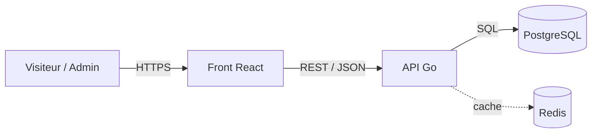
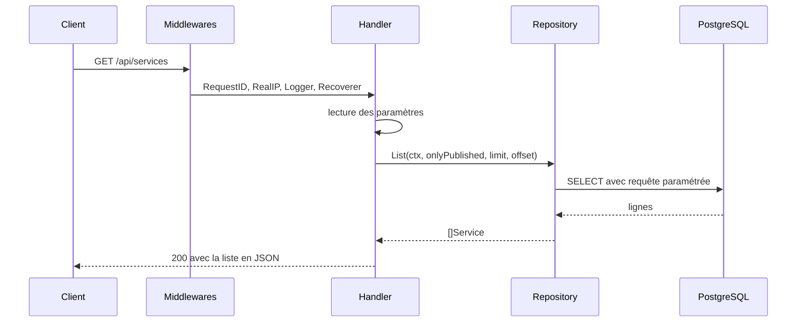

# Corporate Service Portal

Catalogue de services en ligne : vitrine publique, fiche détaillée par service et
espace d'administration. Back-end en Go avec PostgreSQL, front en React.

Reprise et réécriture d'une maquette faite pendant mon stage de développeur web
chez CICAPE. Le dépôt ne couvre que certaines briques du site.

## Stack

Go, chi, pgx, PostgreSQL, Redis, Docker. Front React / TypeScript / Vite / Chakra UI.

## Lancer le projet

L'API :

```bash
docker compose up -d       # PostgreSQL et Redis
go run ./cmd/api           # API sur :8080
curl localhost:8080/health
```

Le front, dans un second terminal :

```bash
cd web
npm install
npm run dev                # front sur :5173
```

Vite proxifie `/api` vers `http://localhost:8080` : le navigateur ne voit qu'une
seule origine, donc pas de CORS en développement. Détails dans
[`web/README.md`](web/README.md).

Variables d'environnement, toutes optionnelles en développement :

| Variable | Défaut | Rôle |
|---|---|---|
| `PORT` | `8080` | port d'écoute |
| `DATABASE_URL` | connexion locale | PostgreSQL |
| `REDIS_URL` | `redis://localhost:6379` | cache |

## Endpoints

| Méthode | Chemin | Description |
|---|---|---|
| `GET` | `/health` | état du service |
| `GET` | `/api/services` | liste, paramètres `published`, `limit`, `offset` |
| `GET` | `/api/services/{slug}` | détail d'un service |
| `POST` | `/api/services` | création |

Un service non publié n'est servi ni par le listing ni par le détail : son slug
répond 404, et non 403, pour ne pas révéler qu'il existe.

Le listing est mis en cache dans Redis pendant 30 secondes et vidé à chaque
création. Si Redis est absent ou en panne, la réponse vient directement de
PostgreSQL.

## Structure

```
cmd/api/           point d'entrée, assemble config, base et routeur
internal/
  config/          lecture des réglages depuis l'environnement
  api/             routeur, handlers, écriture des réponses
  service/         domaine : structure, validation, accès aux données
  db/              pool de connexions et migrations
  cache/           cache Redis, optionnel par construction
  testdb/          base jetable pour les tests d'intégration
web/               front React / TypeScript / Vite, consomme l'API
  src/components/  composants d'affichage, sans accès à l'API
  src/api.ts       seul endroit du front qui connaît les URLs
```

Le paquet `service` contient deux fichiers aux rôles distincts. `model.go` définit
ce qu'est un service et ses règles de validation, sans aucun SQL. `repo.go` est le
seul endroit du projet qui écrit du SQL. Cette séparation permet de tester les
règles métier sans base de données.

Le front suit la même règle. `src/api.ts` est le seul fichier qui connaisse les
URLs de l'API ; les composants de `src/components/` reçoivent en props ce qu'ils
affichent et ne déclenchent aucune requête, ce qui les rend réutilisables et
testables isolément. Deux écrans les assemblent : `Catalogue.tsx`, avec
pagination et bascule des brouillons, et `ServiceDetail.tsx`, sur
`/services/{slug}`.

## Tests

```bash
go test ./...
```

`internal/service/model_test.go` couvre la validation de `CreateInput` en
table-driven, sept cas. Aucune base n'est nécessaire pour le lancer, c'est
précisément ce que permet la séparation décrite au-dessus.

`internal/api/services_test.go` monte le routeur avec `httptest` sur une vraie
base et vérifie qu'un brouillon répond 404 sur le détail. Il a besoin de
PostgreSQL : lancer `docker compose up -d` avant. Sans base joignable il est
ignoré, jamais en échec, pour que `go test ./...` reste vert sur un clone sans
Docker.

## Architecture

Vue d'ensemble des composants :



Trajet d'une requête :



## Choix techniques

**chi plutôt que Gin.** chi reste compatible avec `net/http`, un handler chi est un
`http.HandlerFunc` ordinaire. Rien n'est masqué et on peut en sortir sans réécrire
les handlers.

**Pas d'ORM.** Le SQL est écrit à la main avec pgx. Les requêtes sont paramétrées :
le texte SQL et les valeurs partent séparément, ce qui rend l'injection impossible.
Les colonnes sont listées explicitement plutôt qu'un `SELECT *`, pour qu'un ajout
de colonne ne casse pas le scan.

**Migrations embarquées.** Les fichiers SQL sont inclus dans le binaire avec
`go:embed` et appliqués au démarrage, chacune dans une transaction. Une table de
suivi évite de les rejouer. Le déploiement se réduit à un seul exécutable.

**Prix en centimes.** Stockés en entier, jamais en flottant. `0.1 + 0.2` ne vaut pas
`0.3` en virgule flottante, ce qui produit des erreurs d'arrondi sur des montants.

**Contraintes côté base.** Slug unique, `CHECK` sur la gamme et la durée. La
validation applicative donne des messages clairs, la base reste le dernier rempart
si un bug passe au travers.

**Arrêt propre.** Sur `SIGTERM`, le serveur cesse d'accepter de nouvelles requêtes
et laisse dix secondes à celles en cours pour finir, plutôt que de les couper.

**Pool de connexions borné.** Ouvrir une connexion PostgreSQL coûte cher et le
serveur en accepte un nombre limité. Le pool est plafonné pour ne pas le saturer
sous charge.

**Cache sur le listing, pas sur le détail.** Le listing est la page d'accueil :
une seule réponse sert tous les visiteurs, le taux de réutilisation est élevé. Le
détail est réparti sur autant de slugs qu'il y a de services, chaque entrée
serait lue rarement et occuperait de la mémoire pour rien. Cacher là où ça ne
rapporte pas ajoute un chemin d'invalidation à maintenir sans gain mesurable.

**La clé contient tous les paramètres.** `published`, `limit` et `offset`
changent le résultat, donc les trois entrent dans la clé. En oublier un ferait
servir la page 2 à qui demande la page 1, un bug bien pire que l'absence de
cache. Les valeurs sont bornées par `service.Page` avant de construire la clé et
avant la requête SQL, pour que `limit=0` et `limit=20`, qui donnent le même
résultat, partagent la même entrée.

**TTL court plutôt qu'invalidation fine.** Trente secondes, plus une purge à la
création. Suivre précisément quelles pages une écriture invalide demande de
rejouer la logique de tri et de pagination dans le cache : beaucoup de code, et
un décalage silencieux le jour où la requête change. Le TTL borne l'erreur sans
rien à maintenir. Les entrées vivent dans un seul hash Redis, ce qui rend la
purge atomique et en une commande, sans parcourir l'espace de clés.

**Une panne de Redis ne fait pas tomber l'API.** Le cache est une optimisation,
pas une dépendance. `cache.New` ne se connecte pas au démarrage, chaque commande
est bornée à 200 ms, et toute erreur est journalisée puis ignorée : la réponse
vient de PostgreSQL. Une URL vide donne un cache désactivé, ce qui permet de
déployer sans Redis et de tester sans. Le prix à payer est visible : Redis
injoignable ajoute le délai d'attente à chaque requête, faute de disjoncteur qui
cesserait d'essayer après une série d'échecs.

## À venir

Front : formulaire d'administration avec validation. Authentification et pages
réservées. Déploiement.
