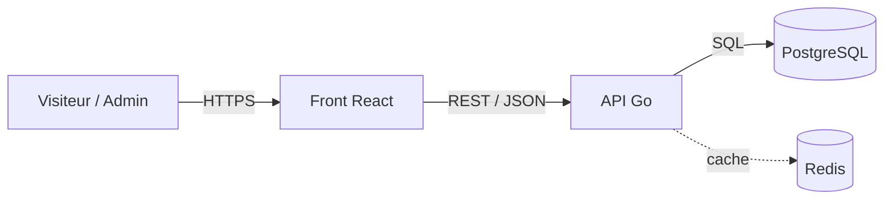
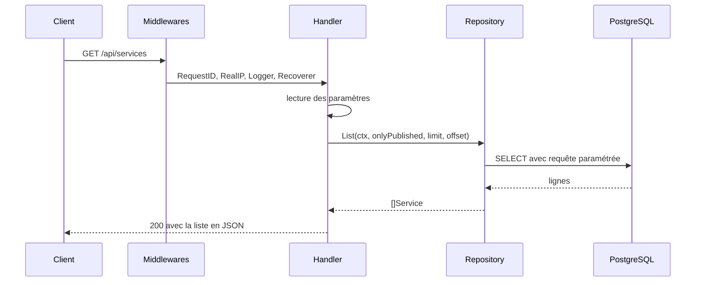

# Corporate Service Portal

Catalogue de services en ligne : vitrine publique, fiche détaillée par service et
espace d'administration. Back-end en Go avec PostgreSQL, front en React.

Reprise et réécriture d'une maquette faite pendant mon stage de développeur web
chez CICAPE. Le dépôt ne couvre que certaines briques du site.

## Stack

Go, chi, pgx, PostgreSQL, Redis, Docker. Front React / TypeScript / Vite / Chakra UI.

## Lancer le projet

```bash
docker compose up -d       # PostgreSQL et Redis
go run ./cmd/api           # API sur :8080
curl localhost:8080/health
```

Variables d'environnement, toutes optionnelles en développement :

| Variable | Défaut | Rôle |
|---|---|---|
| `PORT` | `8080` | port d'écoute |
| `DATABASE_URL` | connexion locale | PostgreSQL |
| `REDIS_URL` | `redis://localhost:6379` | cache |

## Endpoints

| Méthode | Chemin | Description |
|---|---|---|
| `GET` | `/health` | état du service |
| `GET` | `/api/services` | liste, paramètres `published`, `limit`, `offset` |
| `GET` | `/api/services/{slug}` | détail d'un service |
| `POST` | `/api/services` | création |

## Structure

```
cmd/api/           point d'entrée, assemble config, base et routeur
internal/
  config/          lecture des réglages depuis l'environnement
  api/             routeur, handlers, écriture des réponses
  service/         domaine : structure, validation, accès aux données
  db/              pool de connexions et migrations
```

Le paquet `service` contient deux fichiers aux rôles distincts. `model.go` définit
ce qu'est un service et ses règles de validation, sans aucun SQL. `repo.go` est le
seul endroit du projet qui écrit du SQL. Cette séparation permet de tester les
règles métier sans base de données.

## Architecture

Vue d'ensemble des composants :



Trajet d'une requête :



## Choix techniques

**chi plutôt que Gin.** chi reste compatible avec `net/http`, un handler chi est un
`http.HandlerFunc` ordinaire. Rien n'est masqué et on peut en sortir sans réécrire
les handlers.

**Pas d'ORM.** Le SQL est écrit à la main avec pgx. Les requêtes sont paramétrées :
le texte SQL et les valeurs partent séparément, ce qui rend l'injection impossible.
Les colonnes sont listées explicitement plutôt qu'un `SELECT *`, pour qu'un ajout
de colonne ne casse pas le scan.

**Migrations embarquées.** Les fichiers SQL sont inclus dans le binaire avec
`go:embed` et appliqués au démarrage, chacune dans une transaction. Une table de
suivi évite de les rejouer. Le déploiement se réduit à un seul exécutable.

**Prix en centimes.** Stockés en entier, jamais en flottant. `0.1 + 0.2` ne vaut pas
`0.3` en virgule flottante, ce qui produit des erreurs d'arrondi sur des montants.

**Contraintes côté base.** Slug unique, `CHECK` sur la gamme et la durée. La
validation applicative donne des messages clairs, la base reste le dernier rempart
si un bug passe au travers.

**Arrêt propre.** Sur `SIGTERM`, le serveur cesse d'accepter de nouvelles requêtes
et laisse dix secondes à celles en cours pour finir, plutôt que de les couper.

**Pool de connexions borné.** Ouvrir une connexion PostgreSQL coûte cher et le
serveur en accepte un nombre limité. Le pool est plafonné pour ne pas le saturer
sous charge.

## À venir

Front React : catalogue, fiche détaillée, formulaire d'administration avec
validation, authentification et pages réservées. Cache Redis sur le listing.
Déploiement.
