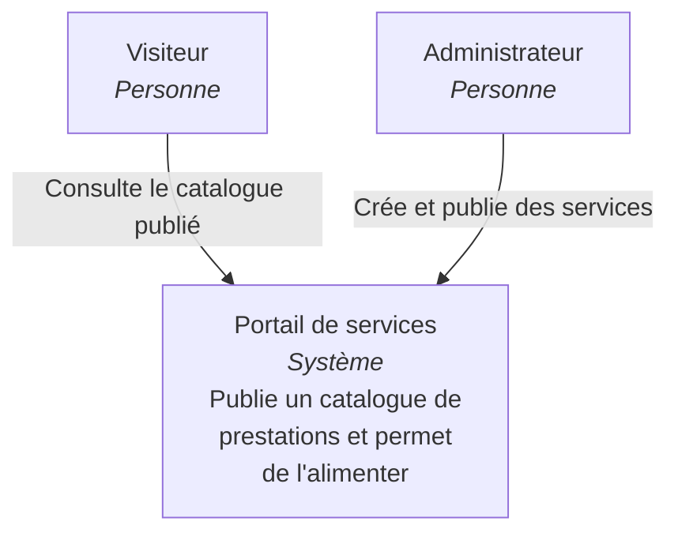
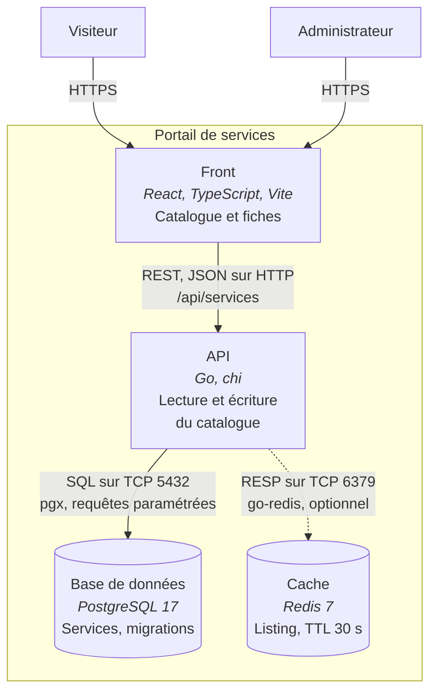
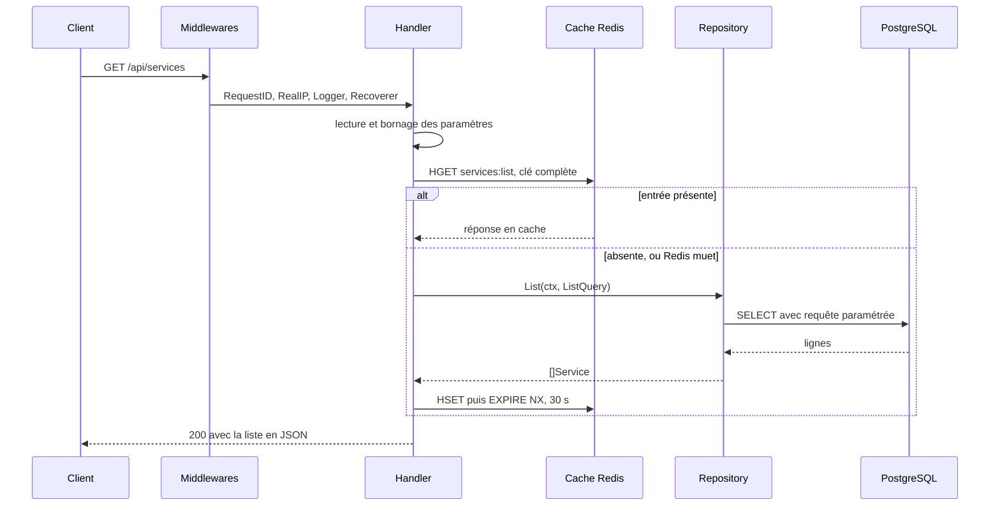

# Corporate Service Portal

Catalogue de services en ligne : API Go avec PostgreSQL et cache Redis, front
React qui la consomme. Le dépôt couvre la vitrine publique et la fiche détaillée
par service. L'espace d'administration du site d'origine n'est pas repris ici :
la création passe par l'API, sans interface ni authentification.

Reprise et réécriture d'une maquette faite pendant mon stage de développeur web
chez CICAPE.

## Stack

Go, chi, pgx, PostgreSQL, Redis, Docker. Front React / TypeScript / Vite / Chakra UI.

## Lancer le projet

Une seule commande, qui démarre la base, le cache, l'API et le front :

```bash
make dev
```

Pour une démonstration, `./scripts/demo.sh` fait la même chose en remplissant
d'abord le catalogue avec un jeu de services, et en se décalant automatiquement
si un port est déjà pris sur la machine. Il ne demande pas `make`.

`make help` liste le reste. Le détail, si on préfère lancer chaque brique
soi-même :

L'API :

```bash
docker compose up -d       # PostgreSQL et Redis
go run ./cmd/api           # API sur :8080
curl localhost:8080/health
```

Le front, dans un second terminal :

```bash
cd web
npm install
npm run dev                # front sur :5173
```

Vite proxifie `/api` vers `http://localhost:8080` : le navigateur ne voit qu'une
seule origine, donc pas de CORS en développement. Détails dans
[`web/README.md`](web/README.md).

Variables d'environnement, toutes optionnelles en développement :

| Variable | Défaut | Rôle |
|---|---|---|
| `PORT` | `8080` | port d'écoute |
| `DATABASE_URL` | connexion locale | PostgreSQL |
| `REDIS_URL` | `redis://localhost:6379` | cache |

## Endpoints

| Méthode | Chemin | Description |
|---|---|---|
| `GET` | `/health` | état du service |
| `GET` | `/api/services` | liste, paramètres `published`, `limit`, `offset`, `after` |
| `GET` | `/api/services/{slug}` | détail d'un service |
| `POST` | `/api/services` | création |

Le détail ne sert jamais un service non publié : son slug répond 404, et non
403, pour ne pas révéler qu'il existe. Le listing le masque aussi par défaut,
mais `published=false` le montre. Ce paramètre est la vue d'administration du
listing et il n'est pas encore protégé, voir « Limites connues ».

Le listing pagine de deux façons. `offset` saute un nombre de lignes ; `after`
reprend après la dernière ligne rendue et ignore `offset`. La réponse porte un
`next_cursor` à passer en `after` pour la page suivante, absent sur la dernière
page. Un curseur illisible répond 400.

Le listing est mis en cache dans Redis pendant 30 secondes et vidé à chaque
création. Si Redis est absent ou en panne, la réponse vient directement de
PostgreSQL.

## Structure

```
cmd/api/           point d'entrée, assemble config, base et routeur
cmd/seed/          remplit le catalogue pour une démonstration
internal/
  config/          lecture des réglages depuis l'environnement
  api/             routeur, handlers, écriture des réponses
  service/         domaine : structure, validation, accès aux données
  db/              pool de connexions et migrations
  cache/           cache Redis, optionnel par construction
  testdb/          base jetable pour les tests d'intégration
web/               front React / TypeScript / Vite, consomme l'API
  src/components/  composants d'affichage, sans accès à l'API
  src/api.ts       seul endroit du front qui connaît les URLs
Makefile           commandes communes aux deux applications
scripts/demo.sh    démarrage complet avec catalogue rempli
.github/workflows/ CI, un job par application
```

Le paquet `service` contient deux fichiers aux rôles distincts. `model.go` définit
ce qu'est un service et ses règles de validation, sans aucun SQL. `repo.go` est le
seul endroit qui écrit du SQL sur les services, en dehors des migrations et du
harnais de test. Aucun handler ne touche à la base directement. Cette séparation
permet de tester les règles métier sans base de données.

Le front suit la même règle. `src/api.ts` est le seul fichier qui connaisse les
URLs de l'API ; les composants de `src/components/` reçoivent en props ce qu'ils
affichent et ne déclenchent aucune requête, ce qui les rend réutilisables et
testables isolément. Deux écrans les assemblent : `Catalogue.tsx`, avec
pagination et bascule des brouillons, et `ServiceDetail.tsx`, sur
`/services/{slug}`.

## Monorepo

Le front et l'API vivent dans le même dépôt. Ce qui en fait un monorepo n'est
pas la cohabitation de deux dossiers, c'est l'outillage qui les tient ensemble :

- **`Makefile` à la racine.** `make dev`, `make build`, `make test`, `make lint`,
  `make clean` marchent quelle que soit la technologie derrière. Personne n'a à
  apprendre deux chaînes d'outils pour contribuer à une moitié du dépôt.
- **Une CI unique**, `.github/workflows/ci.yml`, avec un job par application :
  un job Go qui vérifie le formatage, compile, passe `go vet` et lance les
  tests sur de vrais PostgreSQL et Redis, un job front qui installe, lint et
  construit.
- **Une convention partagée**, `.editorconfig` à la racine, couvrant les deux.

Pourquoi les réunir : un changement de contrat d'API se voit des deux côtés dans
le même commit. `internal/service/model.go` et `web/src/types.ts` décrivent la
même ressource ; séparés en deux dépôts, ils divergent en silence et la panne
n'apparaît qu'à l'exécution. Ici la revue est unique et les versions ne peuvent
pas se désynchroniser.

Le prix à payer est une CI qui grossit : sans précaution, changer une ligne de
CSS relancerait une base PostgreSQL pour rien. D'où les filtres de chemins, qui
ne déclenchent le job Go que si `cmd/`, `internal/`, les fichiers de modules ou
l'outillage partagé ont bougé, et le job front que pour `web/` ou ce même
outillage. Un job `ci` final agrège les résultats, pour qu'une protection de
branche ne bloque pas sur un job volontairement ignoré.

Ce qui n'a pas été fait : déplacer le Go dans `apps/api/` pour « faire plus
monorepo ». Cela casserait les chemins d'import et les commandes, sans rien
apporter que l'outillage ci-dessus ne donne déjà.

## Tests

```bash
go test ./...
```

Tests unitaires, sans dépendance :

- `internal/service/model_test.go` couvre la validation de `CreateInput` en
  table-driven, sept cas. Aucune base n'est nécessaire, c'est précisément ce que
  permet la séparation décrite au-dessus.
- `internal/cache/cache_test.go` vérifie qu'un cache désactivé, mal configuré ou
  injoignable ne fait jamais échouer un appel.

Tests d'intégration, sur les vrais services du `docker-compose` :

```bash
docker compose up -d
go test ./...
```

- `internal/api/list_test.go` monte le routeur avec `httptest` et parcourt le
  catalogue page par page, par `offset` puis par `after` : dans les deux cas
  chaque service inséré apparaît une fois et une seule. Il vérifie aussi qu'une
  création relue par son slug rend exactement la ressource créée, et qu'un
  curseur illisible répond 400.
- `internal/api/services_test.go` vérifie qu'un brouillon répond 404 sur le
  détail.
- `internal/cache/cache_test.go` fait un aller-retour écriture, lecture,
  invalidation sur Redis.

Sans PostgreSQL ni Redis joignables, ces tests sont ignorés, jamais en échec :
`go test ./...` reste vert sur un clone sans Docker. En CI, où les services sont
garantis présents, `REQUIRE_INTEGRATION=1` transforme cet abandon en échec : un
test d'intégration ignoré par erreur de configuration est exactement ce qu'une
CI doit attraper.

`internal/testdb` ouvre toujours la base de l'URL suffixée par `_test`, qu'il
crée au besoin, et vide la table `services` avant chaque test. Les données de
développement ne sont donc jamais touchées, même si `TEST_DATABASE_URL` pointe
la base de dev.

Côté front, il n'y a pas encore de tests unitaires. `make test` y lance ce qui
existe : la vérification de types TypeScript et le lint. Les composants sont
écrits pour être testables, ils ne font aucun appel réseau et ne dépendent que
de leurs props, mais le harnais reste à poser.

`make test` couvre les deux applications d'un coup.

## Architecture

Les deux premiers niveaux du modèle C4. C4 décrit un système à quatre niveaux de
zoom : contexte, conteneurs, composants, code. On s'arrête à deux : les niveaux
3 et 4 redisent ce que le code dit déjà, et se périment à la première refonte,
alors qu'un schéma faux est pire qu'un schéma absent.

### C4 niveau 1, contexte

Qui utilise le système et pour quoi, sans rien dire de la technique.



Aucun système tiers : ni paiement, ni messagerie, ni annuaire. Le portail est
autonome, et le schéma le dit plutôt que de laisser imaginer le contraire.

### C4 niveau 2, conteneurs

Les unités déployables séparément, avec la technologie et le protocole sur
chaque échange.



Le trait plein est une dépendance dure, le pointillé une dépendance optionnelle :
si Redis ne répond pas, l'API sert la même réponse depuis PostgreSQL.

En développement le front et l'API sont deux processus, mais une seule origine
pour le navigateur : Vite proxifie `/api` vers l'API.

### Trajet d'une requête

Ce diagramme ne fait pas partie du C4, c'est une séquence. Il montre ce que les
schémas ci-dessus ne peuvent pas montrer : l'ordre des opérations.



## Choix techniques

**chi plutôt que Gin.** chi reste compatible avec `net/http`, un handler chi est un
`http.HandlerFunc` ordinaire. Rien n'est masqué et on peut en sortir sans réécrire
les handlers.

**Pas d'ORM.** Le SQL est écrit à la main avec pgx. Les requêtes sont paramétrées :
le texte SQL et les valeurs partent séparément, ce qui rend l'injection impossible.
Les colonnes sont listées explicitement plutôt qu'un `SELECT *`, pour qu'un ajout
de colonne ne casse pas le scan.

**Migrations embarquées.** Les fichiers SQL sont inclus dans le binaire avec
`go:embed` et appliqués au démarrage, chacune dans une transaction. Une table de
suivi évite de les rejouer. Le déploiement se réduit à un seul exécutable.

**Prix en centimes.** Stockés en entier, jamais en flottant. `0.1 + 0.2` ne vaut pas
`0.3` en virgule flottante, ce qui produit des erreurs d'arrondi sur des montants.

**Contraintes côté base.** Slug unique, `CHECK` sur la gamme et la durée. La
validation applicative donne des messages clairs, la base reste le dernier rempart
si un bug passe au travers.

**Arrêt propre.** Sur `SIGTERM`, le serveur cesse d'accepter de nouvelles requêtes
et laisse dix secondes à celles en cours pour finir, plutôt que de les couper.

**Pool de connexions borné.** Ouvrir une connexion PostgreSQL coûte cher et le
serveur en accepte un nombre limité. Le pool est plafonné pour ne pas le saturer
sous charge.

**Cache sur le listing, pas sur le détail.** Le listing est la page d'accueil :
une seule réponse sert tous les visiteurs, le taux de réutilisation est élevé. Le
détail est réparti sur autant de slugs qu'il y a de services, chaque entrée
serait lue rarement et occuperait de la mémoire pour rien. Cacher là où ça ne
rapporte pas ajoute un chemin d'invalidation à maintenir sans gain mesurable.

**La clé contient tous les paramètres.** `published`, `limit`, `offset` et
`after` changent le résultat, donc tous entrent dans la clé. En oublier un ferait
servir la page 2 à qui demande la page 1, un bug bien pire que l'absence de
cache. Les valeurs sont bornées par `service.Page` avant de construire la clé et
avant la requête SQL, pour que `limit=0` et `limit=20`, qui donnent le même
résultat, partagent la même entrée.

**TTL court plutôt qu'invalidation fine.** Trente secondes, plus une purge à la
création. Suivre précisément quelles pages une écriture invalide demande de
rejouer la logique de tri et de pagination dans le cache : beaucoup de code, et
un décalage silencieux le jour où la requête change. Le TTL borne l'erreur sans
rien à maintenir. Les entrées vivent dans un seul hash Redis, ce qui rend la
purge atomique et en une commande, sans parcourir l'espace de clés.

**Pagination par curseur en plus de l'offset.** `LIMIT 20 OFFSET 40000` oblige
PostgreSQL à produire puis jeter 40 000 lignes : plus on avance dans le
catalogue, plus la page coûte cher. Le curseur reprend après la dernière ligne
rendue, `WHERE (created_at, id) < (...)`, et lit exactement une page quelle que
soit la profondeur. Mesuré sur 50 000 services, à la page 2000 : l'offset
parcourt 40 020 lignes en 5,7 ms, le curseur en lit 20 en 0,2 ms.

L'ordre de tri est `(created_at DESC, id DESC)` et non `created_at` seul. Sans
départage, deux services créés dans la même microseconde peuvent s'échanger
entre deux requêtes, et l'un apparaît deux fois pendant que l'autre disparaît.
`idx_services_pagination` reprend exactement cet ordre, donc la requête ne trie
rien. La comparaison de n-uplets, plutôt qu'un `created_at < x OR (created_at =
x AND id < y)`, se lit comme le tri et reste utilisable par l'index.

`offset` est conservé : à quelques centaines de lignes il ne coûte rien, il donne
des numéros de page et un retour en arrière, ce que le curseur ne sait pas faire.
C'est pour cela que le catalogue du front continue de l'utiliser. Le curseur est
là pour le jour où le catalogue sera long, et pour un client qui déroule tout.

**Une panne de Redis ne fait pas tomber l'API.** Le cache est une optimisation,
pas une dépendance. `cache.New` ne se connecte pas au démarrage, chaque commande
est bornée à 200 ms, et toute erreur est journalisée puis ignorée : la réponse
vient de PostgreSQL. Une URL vide donne un cache désactivé, ce qui permet de
déployer sans Redis et de tester sans. Le prix à payer est visible : Redis
injoignable ajoute le délai d'attente à chaque requête, faute de disjoncteur qui
cesserait d'essayer après une série d'échecs.

## Limites connues

Ce que le dépôt ne fait pas, dit ici plutôt que découvert à la lecture du code :

- **Aucune authentification.** `POST /api/services` est ouvert, et
  `GET /api/services?published=false` liste les brouillons sans contrôle. Le
  détail, lui, refuse déjà les brouillons, et `GetBySlug` porte le paramètre
  `includeUnpublished` qui deviendra le point de branchement d'un contrôle
  administrateur. Tant que ce contrôle n'existe pas, le dépôt n'est pas
  déployable tel quel sur Internet.
- **Pas de disjoncteur sur Redis.** Si Redis est injoignable, chaque requête paie
  le délai d'attente de 200 ms avant de retomber sur PostgreSQL, au lieu que
  l'API cesse d'essayer après une série d'échecs.
- **`next_cursor` repose sur une page pleine.** Un catalogue dont le nombre de
  services est un multiple exact de `limit` rend un dernier curseur qui mène à
  une page vide. Le client s'arrête donc une requête plus tard que nécessaire,
  sans jamais rien manquer ni répéter.
- **Pas de tests unitaires côté front.** Les composants sont écrits pour être
  testables, ils ne dépendent que de leurs props, mais le harnais reste à poser.
- **Le back ne sert pas le front.** En développement Vite proxifie `/api` ; en
  production, servir `web/dist/` depuis l'API ou un autre serveur reste à faire.

## À venir

Front : formulaire d'administration avec validation. Authentification et pages
réservées. Déploiement.
